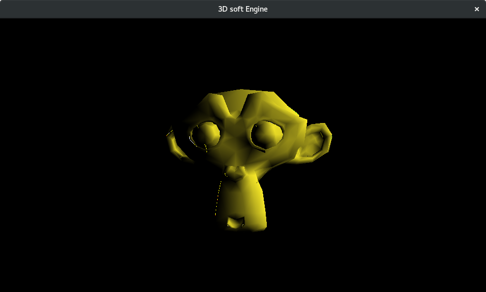
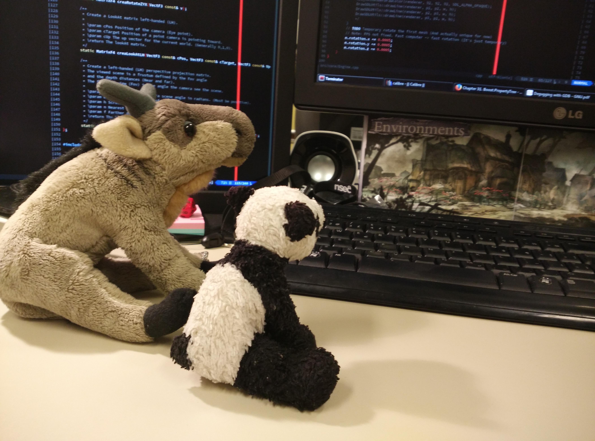
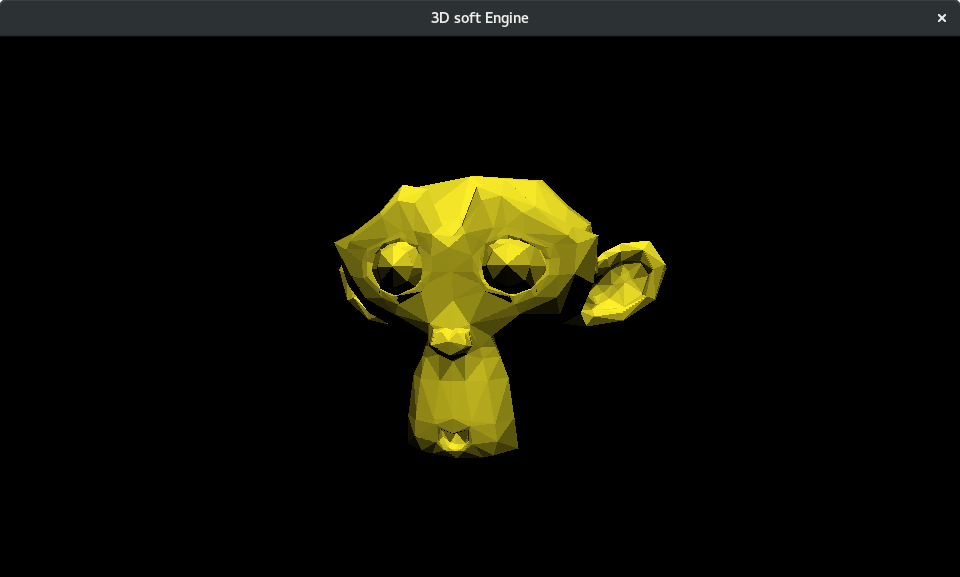
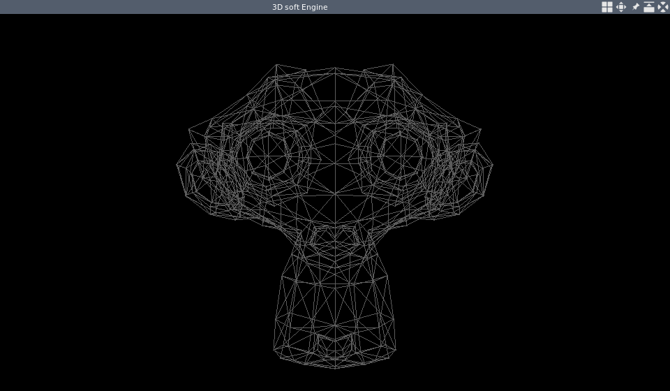

# 3D CPU Engine
My very first 3D engine!
This is a simple 3D rendering engine using CPU (no GPU), for learning purpose.
The main goal of this project was to understand the low-level components of
a 3D engine (e.g., rendering pipeline, drawing algorithm, maths for 3D, rendering loop), as well as learning the C++ language.
Therefore, I used few libraries and tried to re-implements everything,
such as math library and drawing algorithms.


# Features
- Math library
    - Vectors 2
    - Vectors 3
    - Vectors 4
    - Matrix 3
    - Matrix 4
    - Matrix Transformations
        - Translation
        - Scaling
        - Rotations
        - LookAt
        - Perspective
        - Project 3D point into 2D screen
- Mesh
    - Loading from JSON (.babylon format)
- Rendering
    - Draw line
        - DDA algo
    - Draw filled triangle
        - Scanline Algorithm
        - Scanline Algorithm with z-buffering
        - Scanline Algorithm with z-buffering and Flat-Shading
        - Scanline Algorithm with z-buffering and Gouraud Shading
- Render engine
    - Render loaded meshes (by default, renders Suzanne monkey)
    - Zoom in / out
- SSE4.1 optimization (used by the math library)


# Dependencies
> Dependencies marked with *(CMake)* are automatically downloaded by CMake
> and placed in the *dependencies* folder.
> The Others must be installed manually (generally system-wide install).

- [SDL2](https://www.libsdl.org/) (**Must be installed system-wide**)
- [Boost property tree](http://www.boost.org/doc/libs/1_64_0/doc/html/property_tree.html) (**Must be installed system-wide**)
- [GoogleTest](https://github.com/google/googletest) (Downloaded by CMake)


# Build instructions (Linux only)
- Uses C++11
- Requires `pragma once` support

## Build and run engine (CMake)
```bash
# Manual instructions
mkdir build
cd build
cmake ..
make -j2
make runEngine

# Automated script
./build.sh
```

## Build and run tests (CMake)
```bash
mkdir build
cd build
cmake ..
make -j2
make runAllTests

# Automated script
./build.sh
```


# Hard work
As you may see, Gnu and Panda have been working really hard on this project!
Sometime, they even forgot to eat the bamboo.
(At least Panda, Gnu probably prefers the emacs source code).




# Screenshots





# Author
Constantin Masson (geekymoose)


